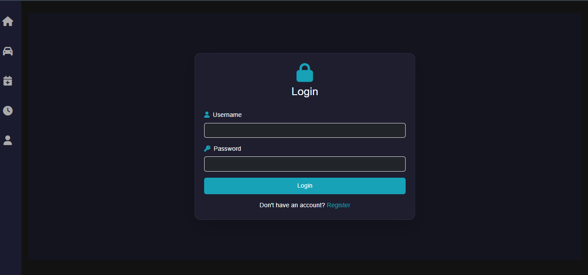
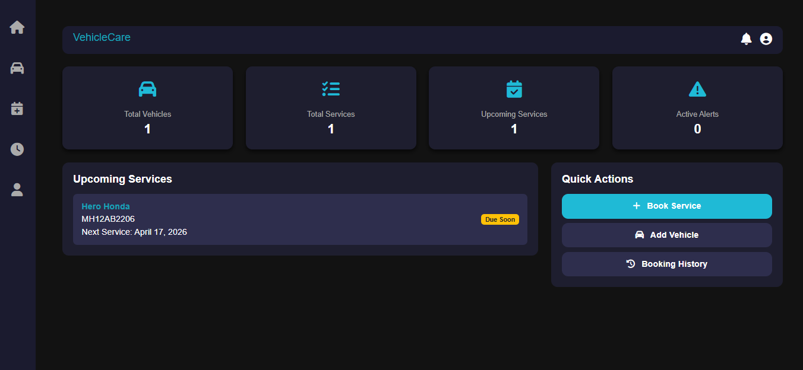
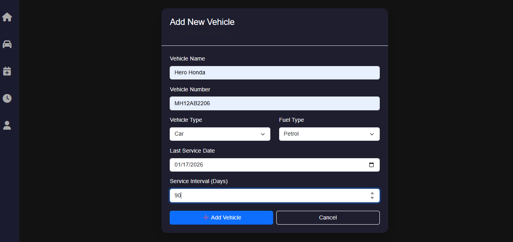
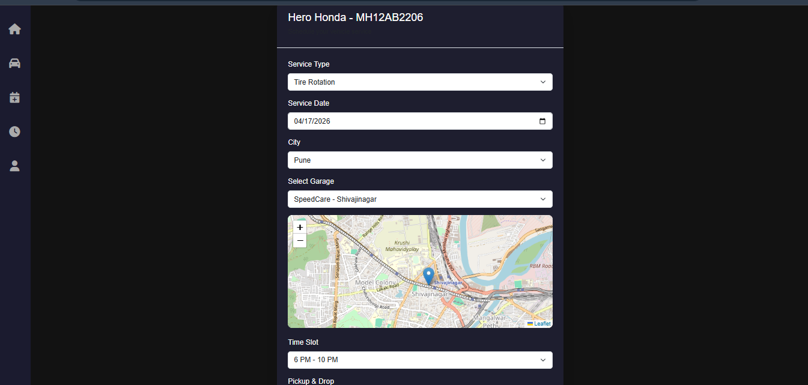
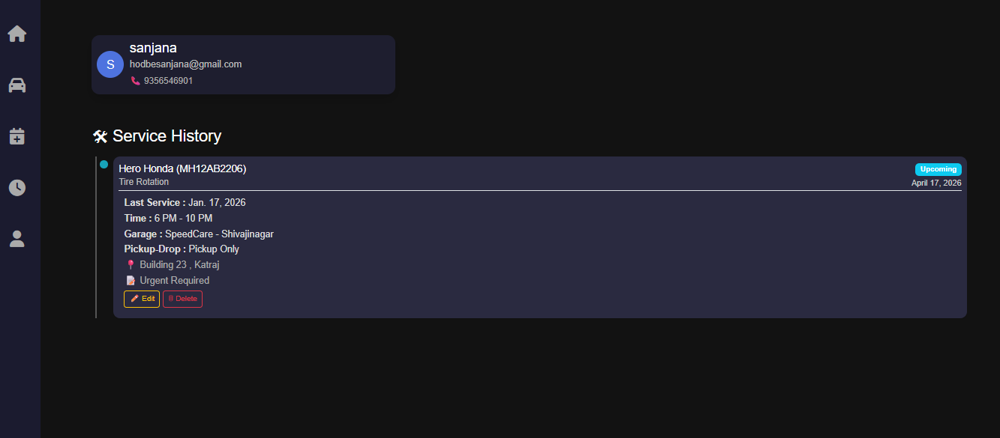
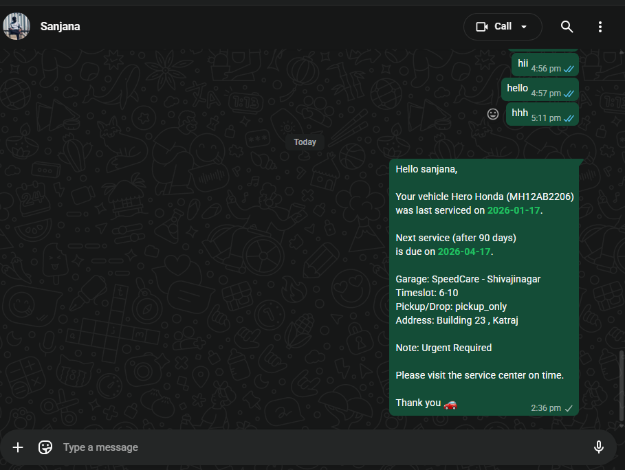

# 🚗 Vehicle Service Reminder System

A smart **Vehicle Service Reminder Web Application** built using Django that helps users track vehicle maintenance schedules, receive reminders, and manage service history efficiently.

---

## ✨ Features

- 🚘 Add and manage multiple vehicles
- 📅 Schedule service reminders
- 🔔 Automated WhatsApp notifications (via Selenium)
- 🧾 Maintain service history records
- 🔐 User authentication system
- 📊 Dashboard for upcoming services
- 💾 SQLite database integration
- 📱 Responsive UI design using Bootstrap

---

## 🧑‍💻 Tech Stack

| Layer        | Technologies Used |
|-------------|------------------|
| Frontend    | HTML, CSS, Bootstrap, JavaScript |
| Backend     | Django (Python) |
| Database    | SQLite |
| Automation  | Selenium (WhatsApp Web Automation) |
| Styling     | Bootstrap |
| Tools       | VS Code, Git, GitHub |

---

## ⚙️ System Architecture

1. User registers / logs in  
2. Adds vehicle details  
3. Sets service reminders  
4. Django stores data in SQLite  
5. Scheduler checks upcoming services  
6. Selenium sends WhatsApp reminder automatically  

---

## 🚀 Installation & Setup

### 1. Clone the repository
```bash
git clone https://github.com/your-username/vehicle-service-reminder.git
```
### 2. Move into project directory
```
cd vehicle-service-reminder
```

### 3. Create virtual environment
```
python -m venv venv
```
### 4. Activate virtual environment
```
venv\Scripts\activate   # Windows
```
### 5. Install dependencies
```
pip install -r requirements.txt
```
### 6. Run migrations
```
python manage.py migrate
```
### 7. Start server
```
python manage.py runserver
```

---

## 📂 Project Structure
```bash
vehicle-service-reminder/
│
├── templates/
├── static/
│   ├── css/
│   ├── js/
│
├── vehicle_app/
│   ├── models.py
│   ├── views.py
│   ├── urls.py
│
├── db.sqlite3
├── manage.py
└── README.md
```

---

## 🔔 How It Works

1. User logs into system
2. Adds vehicle information
3. Sets service date and type
4. System stores data in SQLite
5. Selenium triggers WhatsApp reminder before due date
6. User receives service notification instantly

---

## 📸 Application Screenshots

### Login Page


<br><br>

### Dashboard


<br><br>

### Add Vehicle


<br><br>

### Book Vehicle Service


<br><br>

### Service History


<br><br>

### WhatsApp Reminder (Automation)



